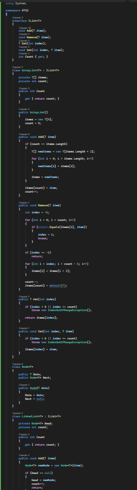
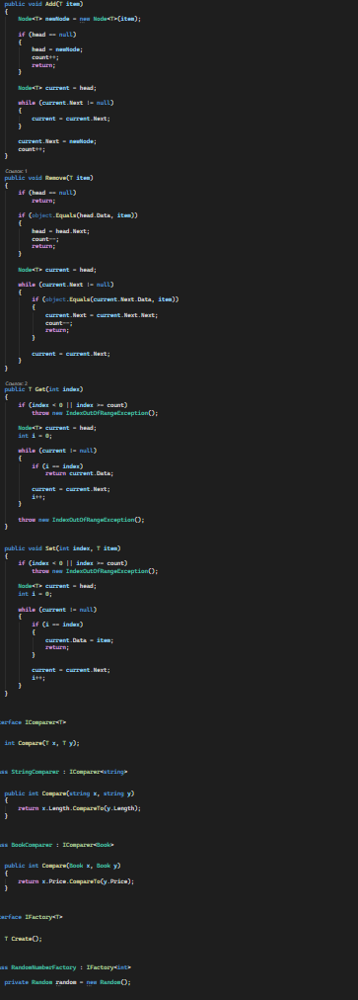
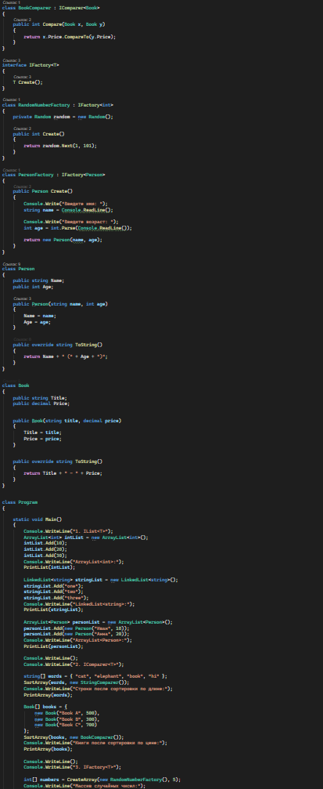
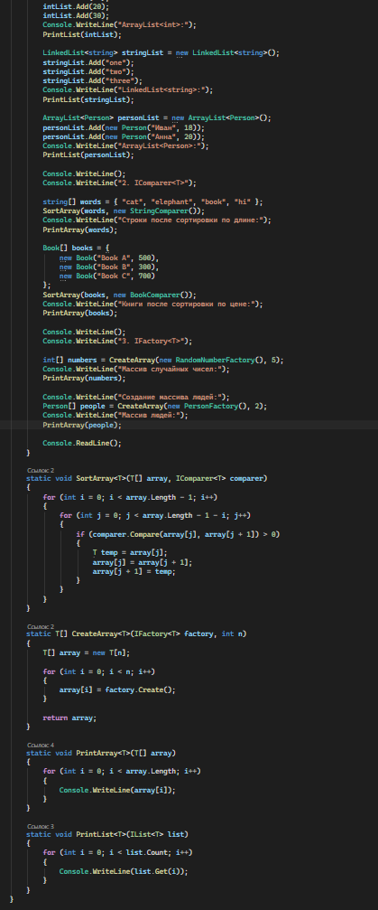
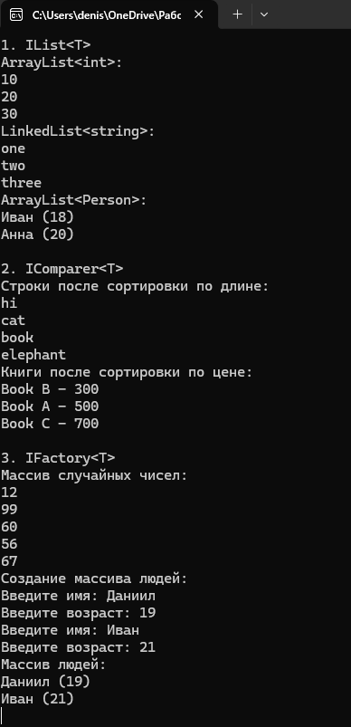

# C# KT12

1. Напишите обобщенный интерфейс IList<T>, который содержит методы для работы с коллекцией элементов типа T: void Add(T item), void Remove(T item), T Get(int index), void Set(int index, T item) и int Count. Затем напишите классы ArrayList<T> и LinkedList<T>, которые реализуют этот интерфейс с помощью массива и связного списка соответственно. Затем напишите пример использования этих классов для хранения и обработки различных типов данных, таких как int, string и Person.

2. Напишите обобщенный интерфейс IComparer<T>, который содержит метод int Compare(T x, T y), который возвращает целое число, указывающее, как первый объект сравнивается со вторым объектом типа T. Затем напишите классы StringComparer и BookComparer, которые реализуют этот интерфейс для типов string и Book соответственно и сравнивают объекты по длине строки и по цене книги. Затем напишите метод, который принимает на вход массив объектов типа T и объект типа IComparer<T> и сортирует массив с помощью этого объекта. Затем напишите пример использования этого метода для сортировки массивов строк и книг.

3. Напишите обобщенный интерфейс IFactory<T>, который содержит метод T Create(), который возвращает новый объект типа T. Затем напишите классы RandomNumberFactory и PersonFactory, которые реализуют этот интерфейс для типов int и Person соответственно и создают объекты с помощью генератора случайных чисел и ввода пользователя. Затем напишите метод, который принимает на вход объект типа IFactory<T> и целое число n и возвращает массив из n объектов типа T, созданных с помощью этого объекта. Затем напишите пример использования этого метода для создания массивов случайных чисел и людей.

### Код

### Результат

